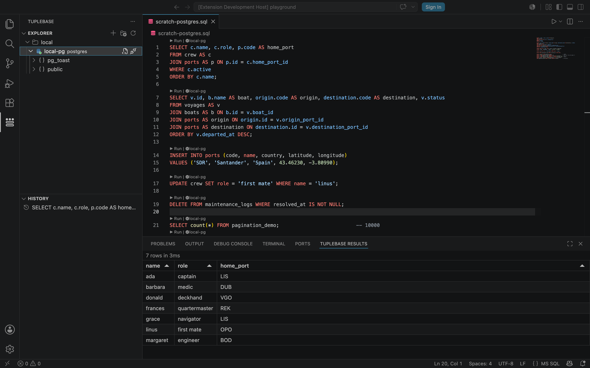

<br>

### Your database workspace, inside VS Code.

Explore schemas, write queries, inspect results, and revisit query history without leaving your editor.

TupleBase keeps connection configuration in a committable `.tuplebase.json` while credentials remain safely stored on your machine. Its built-in MCP server gives AI agents access to the same connections, with writes blocked by default.

> TupleBase `0.1.0` is a pre-release. PostgreSQL is the engine enabled in this first public version.

[Install from the VS Code Marketplace](https://marketplace.visualstudio.com/items?itemName=tuplebase.tuplebase) · [Install from Open VSX](https://open-vsx.org/extension/tuplebase/tuplebase)



## Features

- **Browse schemas** from a connection explorer organized into project-defined groups.
- **Run SQL where you write it** using CodeLens actions, `cmd+enter` / `ctrl+enter`, or whole-file execution.
- **Inspect results** in a VS Code-themed grid with pagination and a structured detail view for each row.
- **Keep configuration with the project** in a comment-friendly `.tuplebase.json` that rejects embedded secrets.
- **Store credentials locally** through VS Code Secret Storage, with optional prompt-on-connect credentials and SSH tunnels.
- **Control writes** at the group or connection level before a statement reaches the database.
- **Return to previous work** through per-workspace query history and one-click reruns.
- **Connect AI agents** through the bundled, standalone MCP server.

## Get started

1. Install the TupleBase pre-release from the [VS Code Marketplace](https://marketplace.visualstudio.com/items?itemName=tuplebase.tuplebase) or [Open VSX](https://open-vsx.org/extension/tuplebase/tuplebase).
2. Open a folder in VS Code, select the TupleBase activity-bar icon, and choose **Create Config**.
3. Add a PostgreSQL connection from the explorer. TupleBase writes its non-secret settings to `.tuplebase.json` and prompts for the password when you first connect.
4. Open a `.sql` file and use the **Run** CodeLens or `cmd+enter` / `ctrl+enter`. TupleBase remembers the connection selected for that file.

A minimal configuration looks like this:

```jsonc
{
  "version": 1,
  "groups": {
    "development": {
      "readonly": true,
      "app-db": {
        "adapter": "postgres",
        "host": "localhost",
        "port": 5432,
        "database": "app",
        "user": "developer"
      }
    }
  }
}
```

Passwords and private keys do not belong in this file. TupleBase stores credentials through VS Code Secret Storage and also supports `${env:VARIABLE}` references for non-secret configuration values.

## Supported engines

**Available in `0.1.0`:** PostgreSQL. **Coming in the next release:** MySQL and MariaDB.

Adapters for SQLite, SQL Server, ClickHouse, Cassandra, Neo4j, MongoDB, Elasticsearch and OpenSearch, Kafka, Redis, and DynamoDB are in development. See the [database support matrix](docs/DATABASES.md) for their current status.

## MCP for AI agents

TupleBase bundles a standalone [Model Context Protocol](https://modelcontextprotocol.io/) server that uses the same connections and adapters as the extension. It gives compatible agents three tools:

- `list_connections` lists configured connections and their safety settings.
- `inspect_schema` explores database objects without issuing ad hoc discovery queries.
- `run_query` executes a statement and returns structured rows, columns, timing, and warnings.

Agent access is read-only by default. Allowing writes requires both an MCP server opt-in and a writable target connection. Run **TupleBase: Show MCP Server Config** to generate a client configuration, and see the [MCP guide](docs/MCP.md) for setup and security details.

## Security, privacy, and support

TupleBase does not collect telemetry or send usage data to TupleBase. It connects only to the database and SSH endpoints you configure.

- Report bugs and request features through [GitHub Issues](https://github.com/TupleBase/tuplebase-vscode/issues).
- Report vulnerabilities privately according to the [security policy](SECURITY.md).
- For other questions, contact [hello@tuplebase.app](mailto:hello@tuplebase.app).

## License

[MIT](LICENSE). Third-party components and their licenses are listed in [THIRD-PARTY-NOTICES](THIRD-PARTY-NOTICES). Database logos come from [devicon](https://github.com/devicons/devicon) (MIT); database names and logos are trademarks of their respective owners and are used to indicate compatibility.
